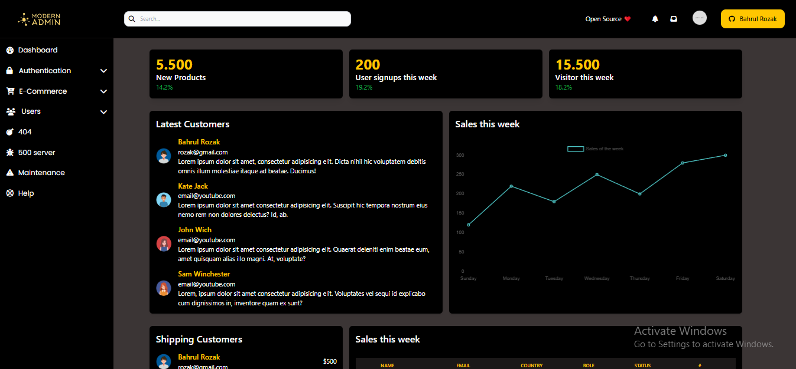

# Modern Admin with Tailwind CSS


## Description

Modern Admin is a sleek and feature-rich admin dashboard built using the powerful Tailwind CSS framework. This project aims to provide a modern and user-friendly interface for administrators to manage and monitor various aspects of their applications or systems.

## Features

- **Responsive Design:** Modern Admin is designed to work seamlessly on a variety of devices, ensuring a consistent and enjoyable user experience.
  
- **Tailwind CSS:** The project harnesses the power of Tailwind CSS to create a highly customizable and efficient styling system, allowing easy theming and styling adjustments.
  
- **Dashboard Overview:** Get a quick overview of key metrics and data with the intuitive and informative dashboard.


  
- **User Management:** Efficiently manage user accounts, roles, and permissions with the dedicated user management section.
  
- **Data Visualization:** Utilize visually appealing charts and graphs to represent complex data in an easy-to-understand manner.
  
- **Customizable Themes:** Tailwind CSS enables easy customization of themes, allowing you to adapt the admin interface to match your brand or project's aesthetic.

## Getting Started

### Prerequisites

- Node.js and npm installed on your machine.

### Installation

1. Clone the repository:

   ```bash
   git clone https://github.com/bahrul-rozak/modern-admin.git
   ```
2. Navigate to the project directory:
   ```bash
   cd modern-admin
   ```

## Preview

